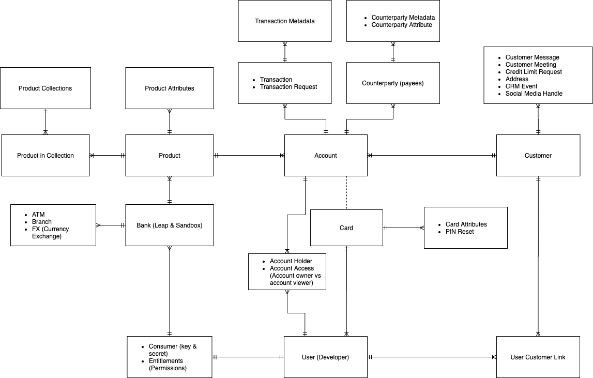

Open Finance Hackathon
=================

Table of Contents
=========

<!--ts-->
   * [Open Finance Hackathon](#open-finance-hackathon)  
   * [Definition of Terms](#definition-of-terms)  
       * [User](#user)  
       * [Consumer](#consumer)  
       * [Account](#account)  
       * [Customer](#customer)  
       * [Counterparty](#counterparty)  
       * [FX (Foreign Exchange)](#fx-foreign-exchange)  
       * [KYC (Know Your Customer)](#kyc-know-your-customer)  
       * [View](#view)  
   * [Resources](#resources)  
       * [Data Tree](#data-tree)  
       * [Simplified ERD](#simplified-erd)  
       * [Full ERD](#full-erd)   
       * [Example projects using Open Banking](#example-projects-using-open-banking)  
          * [<a href="https://github.com/2020-openfinance-hackathon/direct-login-reactjs">ReactJS</a>](#reactjs)  
          * [<a href="https://github.com/2020-openfinance-hackathon/direct-login-python">Python</a>](#python)  
          * [<a href="https://github.com/2020-openfinance-hackathon/direct-login-spring">Springboot</a>](#springboot)  
          * [<a href="https://github.com/2020-openfinance-hackathon/direct-login-flutter">Flutter</a>](#flutter)  
   * [Commonly Asked Questions](#commonly-asked-questions)  
       * [Will a mistake on Acme Bank impact or harm my test data permanently?](#will-a-mistake-on-acme-bank-impact-or-harm-my-test-data-permanently)  
       * [Will changes I make on Acme Bank affect other developers?](#will-changes-i-make-on-acme-bank-affect-other-developers)  
       * [What does check available funds do?](#what-does-check-available-funds-do)  
       * [What is the difference between the Berlin and the UK Standard?](#what-is-the-difference-between-the-berlin-and-the-uk-standard)  
          * [UK Standard / Open Banking](#uk-standard--open-banking)  
          * [Berlin Standard](#berlin-standard)  
<!--te-->

Definition of Terms
=====

### User  
In this case, you, the developer


### Consumer  
The developer, as a consumer, consumes the APIs with a key and secret


### Account  
An account held by a customer at a bank


### Customer  
A person or an entity that holds accounts in a bank


### Counterparty  
The other party that participates in a financial transaction (e.g. a payee)


### FX (Foreign Exchange)  
Currency conversion rates and their titles


### KYC (Know Your Customer)  
Process of verifying the identity of a customer

### View
Ability of a customer to view and make changes their accounts (owner) or give another customer permissions to view it without being able to transact (customer view definition)


Resources
=====

### Data Tree
```bash
├── Bank
│   ├── User 1
│   │   ├── username
│   │   ├── password
│   │   └── customers
|   |   |   └── customer a
|   |   |   |   ├── customer name
|   |   |   |   ├── customer id
|   |   |   |   └── ....
|   |   |   └── customer b
│   │   └── accounts
|   |       └── account a.1
|   |       |   ├── account label
|   |       |   ├── account id
|   |       |   └── transactions
|   |       |       └── transaction i
|   |       |       |   ├── transaction id
|   |       |       |   ├── transaction amount
|   |       |       |   └── ...
|   |       |       └── transaction ii
|   |       └── account a.2
│   ├── User 2
│   │   ├── username
│   │   ├── password
│   │   └── customers
|   |   |   └── customer a
|   |   |   |   ├── customer name
|   |   |   |   ├── customer id
|   |   |   |   └── ....
|   |   |   └── customer b
│   │   └── accounts
|   |       └── account a.1
|   |       |   ├── account label
|   |       |   ├── account id
|   |       |   └── transactions
|   |       |       └── transaction i
|   |       |       |   ├── transaction id
|   |       |       |   ├── transaction amount
|   |       |       |   └── ...
|   |       |       └── transaction ii
|   |       └── account a.2
```

### Simplified ERD


### Full ERD


### Example projects using Open Banking  
#### [ReactJS](https://github.com/2020-openfinance-hackathon/direct-login-reactjs)  
#### [Python](https://github.com/2020-openfinance-hackathon/direct-login-python)  
#### [Springboot](https://github.com/2020-openfinance-hackathon/direct-login-spring)  
#### [Flutter](https://github.com/2020-openfinance-hackathon/direct-login-flutter)  


Commonly Asked Questions
=====

### Will a mistake on Acme Bank impact or harm my test data permanently?  
Yes. However, if it is needed, we can create a new bank with new test data for you.   


### Will changes I make on Acme Bank affect other developers?  
No. Your bank is its own sandbox and will not affect the data of the other developers.  

### What does check available funds do?
It allows another party (a coffee shop) to check your account for funds available for a transaction (coffee purchase) before it gets approved.


### What is the difference between the Berlin and the UK Standard?  

#### UK Standard / Open Banking

##### Use Cases
 - Payment Initiation
 - Account Information

##### Data Fields
 - Schemas were created by a small number of banks but provides more detailed and extensive information

##### Customer Data Consent
 - Customer can specify clusters of their data that can be shared with 3rd parties

##### Message Format
 - Uses JSON based on ISO 20022

##### Authentication
 - Uses the redirect approach

##### User Experience
 - Standardized user experience such as 2FA, consent issuing, and payment authorization

#### Berlin Standard

##### Use Cases
 - Payment Initiation
 - Account Information
 - Fund Confirmation

##### Data Fields
 - Schemas are minimal and required for all banks and based off of online banking masks

##### Customer Data Consent
 - Users are only allowed to share account balances and transaction histories and only for a specific timeframe

##### Message Format
 - Supports JSON with encapsulated ISO20022 based on other standards

##### Authentication
 - Uses authentication via dedicated bank app (decoupled) and credentials carried through the API (embedded)

##### User Experience
 - Each bank defines the user experience

