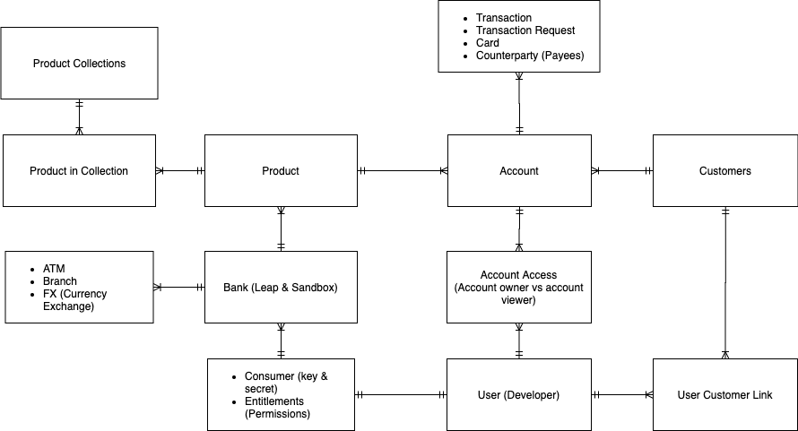

Open Finance Hackathon
=========

<!--ts-->
  * [Open Finance Hackathon](#open-finance-hackathon)
   * [Definition of Terms:](#definition-of-terms)
      * [User](#user)
      * [Consumer](#consumer)
      * [Account](#account)
      * [Customer](#customer)
      * [Counterparty](#counterparty)
      * [FX (Foreign Exchange)](#fx-foreign-exchange)
      * [KYC (Know Your Customer)](#kyc-know-your-customer)
   * [Resources:](#resources)
      * [Simplified ERD](#simplified-erd)
      * [Example projects using Open Banking](#example-projects-using-open-banking)
   * [Commonly Asked Questions:](#commonly-asked-questions)
      * [Will a mistake on Acme Bank impact or harm my test data permanently?](#will-a-mistake-on-acme-bank-impact-or-harm-my-test-data-permanently)
      * [Will changes I make on Acme Bank affect other developers?](#will-changes-i-make-on-acme-bank-affect-other-developers)
      * [What is the difference between the Berlin and the UK Standard?](#what-is-the-difference-between-the-berlin-and-the-uk-standard)
<!--te-->

Definition of Terms:
=====

User
-----
In this case, you, the developer

Consumer
-----
The developer, as a consumer, consumes the APIs with a key and secret

Account
-----
An account held by a customer at a bank

Customer
-----
A person or an entity that holds accounts in a bank

Counterparty
-----
The other party that participates in a financial transaction (e.g. a payee)

FX (Foreign Exchange)
-----
Currency conversion rates and their titles

KYC (Know Your Customer)
-----
Process of verifying the identity of a customer

Resources:
=====

Simplified ERD
-----

Example projects using Open Banking
-----

Commonly Asked Questions:
=====

Will a mistake on Acme Bank impact or harm my test data permanently?
-----
Yes. However, if it needed, we can create a new bank with new test data for you. 

Will changes I make on Acme Bank affect other developers?
-----
No. Your bank is its own sandbox and will not affect the data of the other developers.

What is the difference between the Berlin and the UK Standard?
-----

